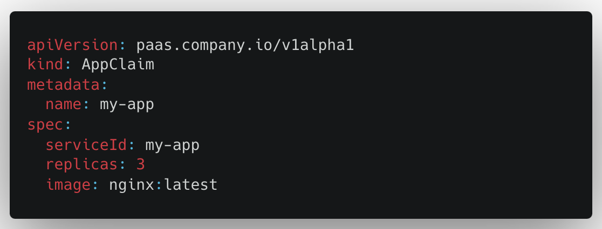
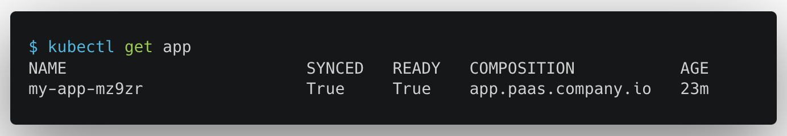
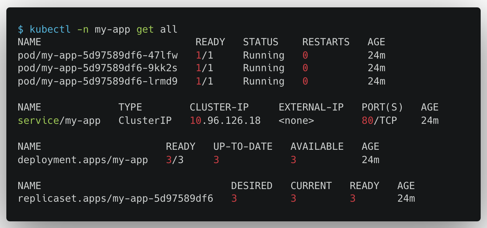
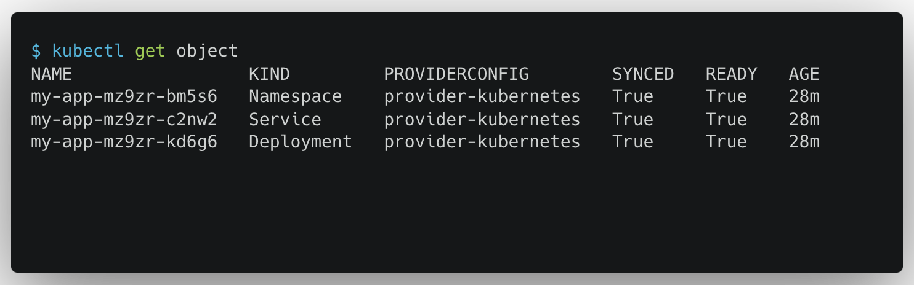

# waterbender

very basic exploration in crossplane compositions for service bundles

## example

### define app bundle

### create / get app

### see created raw resources

### kubernetes-provider managed resources

